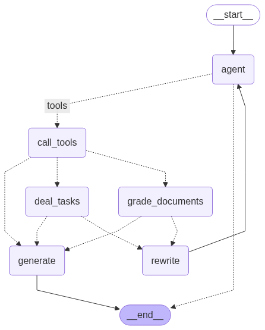

# 1、项目介绍
## 1.1、项目功能概述    
本项目是一个基于MultiAgent的智能项目管理系统，融合了前沿AI技术与实用工程架构，打造了一个全方位的企业级解决方案：

**智能项目管理引擎**                 
采用LangGraph与任意第三方大模型作为核心引擎，通过FastAPI提供高性能后端服务，并结合Gradio实现直观的交互界面。系统支持多种大模型接入方式，包括GPT系列API、国产大模型(OneApi统一接口)、Ollama本地部署模型以及阿里通义千问等，为不同场景和预算提供灵活选择。

**分层记忆架构**                   
系统实现了业界领先的多层次记忆管理机制：
- 短期记忆层：在当前会话中实现上下文感知，通过Graph线程内持久化确保项目需求讨论的连贯性                                
- 长期记忆层：跨会话的知识积累系统，通过Graph跨线程持久化实现项目历史信息和决策记录的长期保存               
- 智能记忆管理：采用专有算法对项目历史进行动态修剪和语义过滤，优化上下文窗口利用率，在保持项目管理质量的同时显著降低计算资源消耗和API调用成本。

**企业级持久化存储**                   
基于PostgreSQL构建的高可靠性数据持久化系统，采用连接池技术和事务管理确保数据一致性。系统实现了项目状态检查点、需求记忆索引和检索优化，支持高并发访问和故障恢复，满足企业级应用的严格要求。

**智能工作流与动态路由框架**                
基于LangChain和LangGraph构建的复杂工作流系统，通过有向图结构实现灵活的业务逻辑编排。系统集成了需求识别、资源调用协调和动态决策路由，能够根据项目上下文智能处理各类复杂需求拆分和人员分配请求。

**高级工作流程**             
1. 项目需求分析：系统对输入进行深度语义理解，提取核心需求和关键任务点                  
2. 智能决策引擎：基于需求分析结果，系统动态决定最优任务拆分和资源分配路径                       
3. 资源协调与执行：系统可并行调用多种专业工具，并根据工具特性进行智能路由：                
   - 检索增强工具：进行多维度相关性评分和质量控制，确保历史项目经验的准确性和参考价值                               
   - 功能性工具：直接执行项目管理逻辑并生成结构化任务分配结果                      
4. 方案生成与优化：综合工具输出和上下文信息，生成个性化、专业且可执行的项目计划和人员分配方案                 

**全栈服务架构**
系统提供了完整的RESTful API接口和响应式Web界面，支持项目创建与恢复、历史记录查询、用户认证与权限管理等企业级功能。采用模块化设计，便于与现有项目管理系统集成或进行定制化扩展。

**技术亮点**
- 并行资源调用：通过线程池技术实现资源的并行分配，显著提升响应速度
- 自适应重试机制：针对网络波动和服务不稳定情况，实现指数退避策略的智能重试
- 全链路日志追踪：详细记录系统各环节运行状态，便于问题诊断和性能优化
- 可视化状态图：支持将复杂工作流导出为直观图形，便于项目规划和进度监控

整体架构如下图所示:                      
                   
**（1）核心功能：基于状态图的项目管理流程**         
定义了一个包含多个节点（Node）和边（Edge）的项目管理工作流，节点包括：                         
agent：分析用户需求并决定是否调用资源分配工具                    
call_tools：并行执行资源调用和任务分配
deal_tasks：对用户需求进行分解，分解成更细力度的子任务                   
grade_documents：评估检索到的历史项目文档与当前需求的相关性               
rewrite：重写用户需求以改进任务拆分                   
generate：生成最终项目计划和人员分配方案                
动态路由：                
route_after_tools：根据资源调用结果决定下一步是生成方案还是评估历史项目文档              
route_after_grade：根据文档相关性评分决定生成方案还是重写需求                       
**（2）资源调用与并行处理**                
资源配置：通过ToolConfig类管理资源列表和路由配置，支持动态路由（检索类工具路由到grade_documents，其他路由到generate）               
并行资源节点：ParallelToolNode使用线程池（ThreadPoolExecutor）并行执行多个资源调用，提高效率，支持最大工作线程数配置（默认5）          
**（3）数据库与持久化存储**                
连接池管理：使用ConnectionPool管理PostgreSQL数据库连接，支持自动提交、超时设置和连接池状态监控（monitor_connection_pool）                 
线程内持久化：通过PostgresSaver保存项目状态检查点                 
跨线程持久化：通过PostgresStore存储项目记忆（store_memory），支持项目历史搜索和存储（如用户输入包含"记录"时保存）                  
重试机制：数据库操作使用tenacity库实现重试（最多3次，指数退避等待），提高健壮性                    
**（4）自然语言处理与提示模板**               
语言模型：通过get_llm获取聊天模型（llm_chat）和嵌入模型（llm_embedding），用于处理用户需求和生成项目方案              
提示模板：使用create_chain函数加载并缓存提示模板文件（如代理、重写、评分、生成模板），支持结构化输出（如ProjectRelevanceScore）          
消息过滤：filter_messages过滤消息，仅保留AIMessage和HumanMessage，限制最多保留5条历史消息                
**（5）日志与错误处理**           
日志记录：使用logging模块和ConcurrentRotatingFileHandler记录详细日志（DEBUG级别），支持文件轮转（5MB，3个备份）             
错误处理：多层次异常捕获（如数据库连接、资源调用、状态访问等），记录错误并提供默认路由或提示用户                
**（6）用户交互与响应输出**                  
主循环：main函数实现交互式项目管理对话，用户输入需求后通过graph_response处理并输出项目方案，支持退出命令（quit、exit、q）                 
响应区分：区分资源输出（显示资源名称）和大模型输出（项目方案），提升用户体验                    
**（7）辅助功能**                
可视化：通过save_graph_visualization将状态图保存为PNG文件，便于项目规划和监控             
配置管理：通过Config类统一管理日志文件路径、数据库URI、提示模板路径等配置                           
**基于FastAPI、Gradio、LangChain、LangGraph框架实现需求拆分和人员分配的项目管理工作流用例并对外提供API服务**                      
主要内容:在第四期视频的应用案例4的基础上，使用FastAPI封装API接口对外提供web服务，并使用Gradio实现一个web端页面支持新建项目、历史项目加载、用户注册和登录等                        

## 1.2 RAG在项目中的应用
**检索增强生成(RAG)技术概述**
RAG(Retrieval-Augmented Generation)是一种将检索系统与生成式AI模型结合的技术框架，通过从外部知识库检索相关信息来增强大语言模型的输出质量。在本项目中，RAG扮演着至关重要的角色，为项目管理决策提供历史经验支持和专业知识参考。

**RAG在本项目中的核心作用**
1. **历史项目经验检索**：系统将历史项目文档向量化存储在PostgreSQL数据库中，当用户提出新的项目需求时，RAG系统能够自动检索与当前需求相似的历史项目案例，为新项目规划提供参考。

2. **智能相关性评分**：通过grade_documents节点，系统对检索到的历史文档进行多维度相关性评分，确保只有高质量、高相关性的历史经验被纳入决策参考。

3. **知识增强决策**：基于检索到的历史项目文档，系统能够更准确地理解行业最佳实践、常见陷阱和成功经验，从而生成更专业、更可行的项目计划和人员分配方案。

4. **动态知识库更新**：系统不断将新完成的项目信息添加到知识库中，实现知识的累积和迭代优化，使RAG系统随着使用变得越来越智能。

**RAG技术实现细节**
1. **文档处理流程**：
   - 文档加载：支持PDF、Word、文本等多种格式的项目文档
   - 文档切分：使用递归字符分割器(RecursiveCharacterTextSplitter)将文档分割成适合向量化的片段
   - 向量化：使用大模型的嵌入功能(llm_embedding)将文本片段转换为高维向量
   - 存储：将向量和原始文本存储在支持pgvector的PostgreSQL数据库中

2. **检索机制**：
   - 语义检索：将用户需求转换为查询向量，在向量数据库中查找最相似的文档片段
   - 混合检索：结合关键词匹配和语义相似度，提高检索准确性
   - 相关性过滤：通过阈值筛选，只保留高相关性文档

3. **RAG增强工作流**：
   - 检索触发：当系统判断需要历史经验参考时，触发RAG检索流程
   - 文档评分：对检索结果进行相关性评分和质量评估
   - 路由决策：根据评分结果，系统动态决定是直接生成方案还是需要重写需求
   - 知识融合：将检索到的相关知识与用户需求融合，生成更专业的项目方案

**RAG系统优势**
1. **减少幻觉**：通过引入真实的历史项目数据，显著减少大模型生成内容中的幻觉问题
2. **提升专业性**：利用企业内部积累的专业知识，使生成的项目方案更符合行业标准和企业实践
3. **个性化定制**：基于企业自身的项目历史进行决策，而非通用知识，实现高度个性化
4. **持续学习**：随着项目库的扩充，系统的专业能力不断提升，形成良性循环

通过RAG技术的深度集成，本项目实现了从"通用AI助手"到"专业项目管理顾问"的转变，能够提供基于企业实际经验的高质量项目管理建议，大幅提升项目规划和资源分配的准确性与可行性。

## 1.3 LangGraph介绍 
LangGraph 是由 LangChain 团队开发的一个开源框架，旨在帮助开发者构建基于大型语言模型（LLM）的复杂、有状态、多主体的应用           
它通过将工作流表示为图结构（graph），提供了更高的灵活性和控制能力，特别适合需要循环逻辑、状态管理以及多主体协作的场景            
比如智能代理（agent）和多代理工作流            
官方文档:https://langchain-ai.github.io/langgraph/                     

## 1.4 核心概念 
**图结构（Graph Structure）**              
LangGraph 将应用逻辑组织成一个有向图，其中：                    
节点（Nodes）:代表具体的操作或计算步骤，可以是调用语言模型、执行函数或与外部工具交互等                
边（Edges）:定义节点之间的连接和执行顺序，支持普通边（直接连接）和条件边（基于条件动态选择下一步）               
**状态管理（State Management）**              
LangGraph 的核心特点是自动维护和管理状态     
状态是一个贯穿整个图的共享数据结构，记录了应用运行过程中的上下文信息         
每个节点可以根据当前状态执行任务并更新状态，确保系统在多步骤或多主体交互中保持一致性               
**循环能力（Cyclical Workflows）**               
与传统的线性工作流（如 LangChain 的 LCEL）不同，LangGraph 支持循环逻辑          
这使得它非常适合需要反复推理、决策或与用户交互的代理应用         
例如，一个代理可以在循环中不断调用语言模型，直到达成目标                

## 1.5 主要特点
**灵活性:** 开发者可以精细控制工作流的逻辑和状态更新，适应复杂的业务需求            
**持久性:** 内置支持状态的保存和恢复，便于错误恢复和长时间运行的任务             
**多主体协作:** 允许多个代理协同工作，每个代理负责特定任务，通过图结构协调交互             
**工具集成:** 可以轻松集成外部工具（如搜索API）或自定义函数，增强代理能力           
**人性化交互:** 支持"人在回路"（human-in-the-loop）功能，让人类在关键步骤参与决策            
 
## 1.6 使用场景
LangGraph 特别适用于以下场景：             
**对话代理:** 构建能够记住上下文、动态调整策略的智能项目管理助手             
**多步骤任务:** 处理需要分解为多个阶段的复杂项目，如需求分析、任务拆分或资源分配                
**多代理系统:** 协调多个代理分工合作，比如一个负责需求分析、另一个负责人员分配的系统           

## 1.7 与 LangChain 的关系
LangGraph 是 LangChain 生态的一部分，但它是独立于 LangChain 的一个模块             
LangChain 更擅长处理简单的线性任务链（DAG），而 LangGraph 专注于更复杂的循环和多主体场景           
你可以单独使用 LangGraph，也可以结合 LangChain 的组件（如提示模板、工具接口）来增强功能                  

# 2、前期准备工作
## 2.1 集成开发环境搭建  
anaconda提供python虚拟环境,pycharm提供集成开发环境                                              

## 2.2 大模型LLM服务接口调用方案
(1)gpt大模型等国外大模型使用方案                  
国内无法直接访问，可以使用代理的方式，具体代理方案自己选择                        
(2)非gpt大模型方案 OneAPI方式或大模型厂商原生接口                                              
(3)本地开源大模型方案(Ollama方式)                                              
                

# 3、项目初始化
## 3.1 构建项目
使用pycharm构建一个项目，为项目配置虚拟python环境             
项目名称：LangGraphProjectManager                                
虚拟环境名称保持与项目名称一致                

## 3.2 将相关代码拷贝到项目工程中           
直接将下载的文件夹中的文件拷贝到新建的项目目录中                      

## 3.3 安装项目依赖          
命令行终端中直接运行如下命令安装依赖                  
pip install langgraph==0.2.74                  
pip install langchain-openai==0.3.6            
pip install fastapi==0.115.8                         
pip install uvicorn==0.34.0                          
pip install gradio==5.18.0           

# 4、项目测试
## 4.1 基于LangChain、LangGraph框架和PostgreSQL数据库，结合工具调用和动态路由实现项目需求拆分和人员分配工作流用例            
在运行脚本前，打开命令行终端按照如下命令进行相关依赖安装：                            
pip install langchain-community==0.3.19                        
pip install langchain-chroma==0.2.2                        
pip install pdfminer                     
pip install pdfminer.six                         
pip install nltk==3.9.1                      
pip install psycopg2==2.9.10              
pip install concurrent-log-handler==0.9.25                           

### 步骤1：PostgreSQL持久化记忆存储  
进入官网 https://www.docker.com/ 下载安装Docker Desktop软件并安装，安装完成后打开软件                
打开命令行终端，cd 04_ProjectManagerWithPostgres文件夹下，PostgreSQL的docker配置文件为docker-compose.yml             
运行 docker-compose up -d 命令后台启动PostgreSQL数据库服务。运行成功后可在Docker Desktop软件中进行管理操作或使用命令行操作或使用指令        
若要删除容器在命令行终端中运行 docker-compose down --volumes                      
因为LangGraph的PostgresStore需要使用到pgvector，因此需要在容器中按照如下步骤进行操作，直接使用Docker Desktop软件中进行操作                         
安装依赖           
apt update               
apt install -y git build-essential postgresql-server-dev-15                 
编译并安装 pgvector          
git clone --branch v0.7.0 https://github.com/pgvector/pgvector.git                
cd pgvector               
make                 
make install                
验证安装，检查扩展文件是否安装成功                    
ls -l /usr/share/postgresql/15/extension/vector*                     
接下来，若要在脚本中进行使用，首先在系统环境中需要安装PostgreSQL 的开发库（libpq），因为 psycopg 需要它来编译或运行,根据自己的操作系统选择进行安装                                 
MacOS (使用 Homebrew): brew install postgresql                 
最后，再安装相关依赖包              
pip install langgraph-checkpoint-postgres                    
pip install psycopg psycopg-pool        
同时，使用数据库客户端软件远程登陆进行可视化操作，这里使用Navicat客户端软件          

### 步骤2：知识灌库 
运行vectorSaveTest.py脚本，文档加载->文档切分->向量化->灌入向量数据库            

### 步骤3：demo测试
在使用python demoRagAgent.py命令启动脚本前，需根据自己的实际情况调整代码中的llms.py中关于大模型配置参数的调整                
**注意事项:**             
在测试使用调用oneapi(阿里通义千问)、qwen的接口时，会报错如下所示：                
openai.BadRequestError: Error code: 400 - {'error': {'message': 'input should not be none.: payload.input.contents (request id: 2024082015351785023974771558878)', 'type': 'upstream_error', 'param': '400', 'code': 'bad_response_status_code'}}              
经过分析后，langchain_openai/embeddings包中的base.py源码中默认如下代码的true改为false                
check_embedding_ctx_length: bool = False                   
源码完整路径如下所示:                  
/opt/anaconda3/envs/RagLangchainTest/lib/python3.11/site-packages/langchain_openai/embeddings/base.py          
修改后重新启动main服务，进行重新测试              

### 步骤4：启动main脚本
在使用python main.py命令启动脚本前，需根据自己的实际情况调整代码中的如下参数                                   
llms.py中关于大模型配置参数的调整，以及main.py脚本中的服务IP和PORT、LangSmith平台的API KEY等的设置                        

### 步骤5：运行webUI脚本进行测试             
再使用python webUI.py命令启动脚本前，需根据自己的实际情况调整代码中的如下参数，运行成功后，可以查看smith的跟踪情况                     
是否要流式输出可设置stream_flag = False或True，检查URL地址中的IP和PORT是否和main脚本中相同            
运行成功后直接打开网址，在浏览器端进行交互测试              
